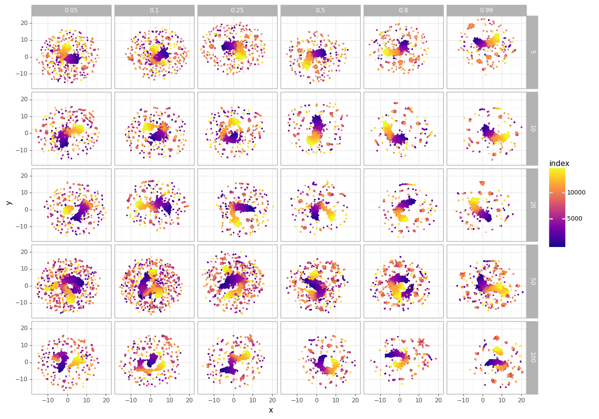
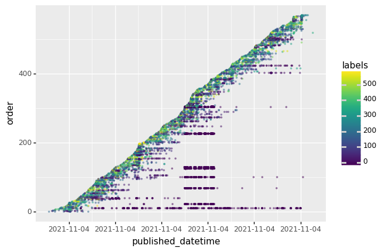
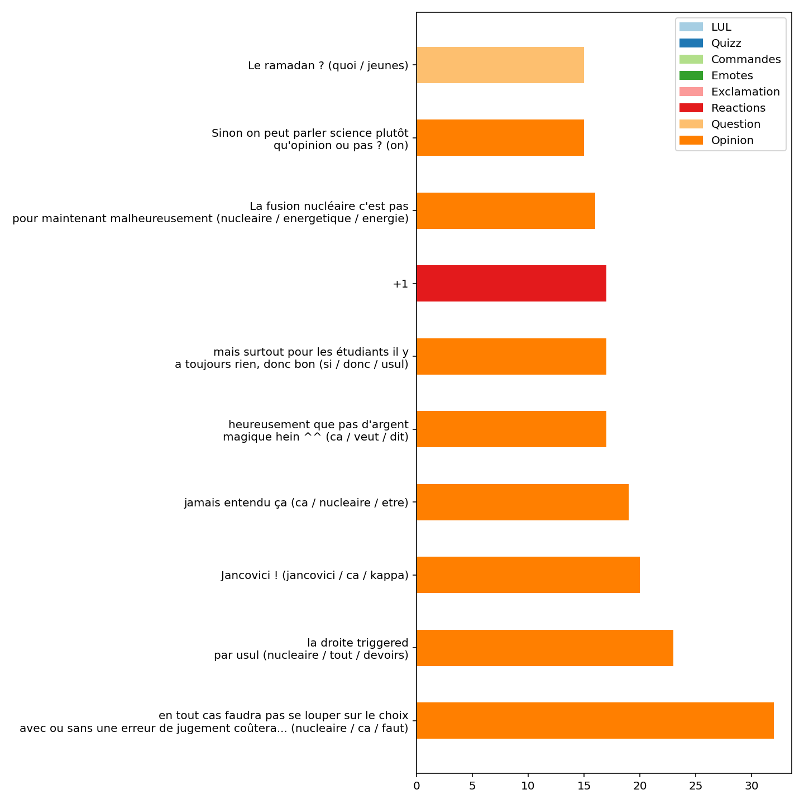

# twitchat-ds

> Projet twitchat-ds de Lincoln

* Auteur: Lincoln
* Date de création: 2021-08-18
* voir [AUTHORS.md](./AUTHORS.md)

## Table des matières

1. [Présentation](#présentation)
2. [Démarche](#démarche)
3. [Données](#données)
4. [Modèles](#modèles)
5. [Application](#application)
6. [Les répertoires](#les-répertoires)
7. [Les fichiers importants](#les-fichiers-importants)

## Présentation

`twichatds` est un module d'expérimentation autour du NLP dans le contexte des données Twitch.

L'objectif de l'expérimentation est sur deux plans : 

*Méthodologique*:
* Création d'un modèle de langue sur les données FR Twitch
* Représentaiton vectorielle d'un message horodaté
* Clustering via les méthodes S-BERT et BERTopic

*Métier*:
* Identifier les types de messages dans un chat pendant un stream
* Identifier les sujets importants

## Démarche

1. Nettoyage des données: `make prepare_data`
2. Construction d'un tokenizer: `make train_tokenizer`
3. Entrainement d'un modèle ConvBERT small: `make create_electra_data` + adapation de [yitu-opensource/ConvBert](https://github.com/yitu-opensource/ConvBert) + `make convert_convbert`
4. Entrainement d'un modèle MLM à partir du modèle précédent: `make train_mlm_gpu`
5. Entrainement d'un modèle SimCSE: `make train_simcse_gpu` 

## Données

| Streamer                                      | Nbr de messages | Categories notables en 2021\*      |
| --------------------------------------------- | --------------- | ---------------------------------- |
| Ponce                                         | 2 604 935       | Chatting/Mario Kart/FIFA           |
| Domingo                           | 1 209 703       | Chatting/talk-shows/FM2O21         |
| Mistermv                                      | 1 205 882       | Isaac/Special events/TFT           |
| Zerator                                       | 900 894         | New World/WOW/Valorant             |
| Blitzstream                                   | 821 585         | Chess                              |
| Squeezie                                      | 602 148         | Chatting / Minecraft               |
| Antoinedaniellive                             | 548 497         | Geoguessr                          |
| Jeanmassietaccropolis/jeanmassiet | 301 387         | Talk-shows/chatting/special events |
| Samueletienne                                 | 215 956         | chatting                           |

Sur la période du 12/03/2021 au 22/07/2021. La totalité des messages comptent 9 410 987 messages sur ces neufs streamers. Ces messages sont issus du canal IRC, donc n’ont pas subi de modération. 

## Modèles 

_(à publier sur HF)_

* 2021twitchfr-conv-bert-small
* 2021twitchfr-conv-bert-small-mlm
* 2021twitchfr-conv-bert-small-mlm-simcse

## Application

Application sur l'émission "Backseat" de Jean Massiet du 04/11/2021. Nous nous sommes approprié la méthodologie [BERTopic](https://github.com/MaartenGr/BERTopic) pour intégrer une dimension temporelle. 

1. Le script `scripts/backseat_representation.py` permet de représenter les messages à l'aide de UMAP:


2. Le script `scripts/backseat_topic_clustering.py` applique le clustering et retourne plusieurs éléments (mis à disposition dans `assets/`). 

 ou la version interactive [ici](./assets/scale_600/plotly_labels_x_over_time.html) et [ici](./assets/scale_600/plotly_mean_labels.html) la représentation moyenne des clusters à deux dimensions.

L'ensemble des clusters [ici](./assets/scale_600/print_clusters.txt) en texte.

3. Le script `scripts/backseat_chart_over_time.py` retourne un graphique en barre avec les sujets plus discutés sur une fenêtre temporelle. Par exemple entre 19h30 et 20h00 :



Et la version vidéo: https://youtu.be/EcjvlE9aTls


## Les répertoires

```bash
.
├── twitchat-ds       # module principal
├── requirements/       # dossier contenant les requirements pip python
├── tests/              # dossier contenant les tests du package (non utilisé ici)
├── logs/               # dossier contenant les logs : dev specific
├── scripts/            # dossier contenant les scripts utilisant le package
├── docs/               # documentations générées par sphinx (non pertinent ici)

```

## Les fichiers importants

```bash
.
├── twitchat-ds
│   ├── __init__.py                 # fonctions principales du package
│   ├── cli.py                      # command line interface 
│   ├── clustering.py               # classes pour le clustering
│   ├── berttopic.py                # réecriture de classe
│   ├── fh_utils.py                 # HuggingFace uitilities
├── README.md                       # this file
├── LICENSE                         # license si besoin
├── Makefile                        # Makefile: aide à la compilation
├── .gitignore                      # Liste des éléments que git doit ignorer lors du commit
├── environment.yml                 # Fichier de configuration de l'environnment conda
├── setup.cfg                       # aide au setup.py
├── setup.py                        # setup.py pour créer un package python
├── tox.ini                         # aide pour les tests
```


## Credits

This package was inspired by Cookiecutter_ and the `audreyr/cookiecutter-pypackage`_ project template.

*  _Cookiecutter: https://github.com/audreyr/cookiecutter
*  _`audreyr/cookiecutter-pypackage`: https://github.com/audreyr/cookiecutter-pypackage

